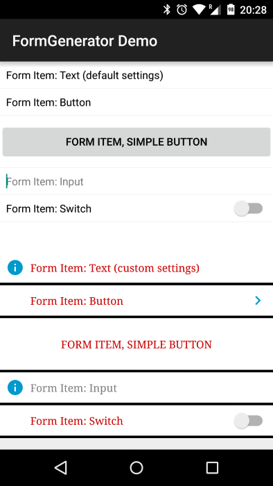

# Form Generator

## Summary
Generates customizable forms for Android 11+. Form items include:

* Simple text
* Text buttons
* Standard Android buttons
* Standard Android borderless buttons
* Switches
* Input fields
* Lines
* Spaces

Customization includes:

* Text color
* Text size
* Text typeface
* Background color (can be solid colors, drawables, or a color state list)
* Input background (For the EditTexts)
* Icon color
* Padding size
* Line width and color
* Space width and color
* Whether or not lines should be shown after form items
* Switch on and off text

## Instructions

To include this in your project, you can add it with Gradle by using [JitPack](https://jitpack.io).
Replace X.X.X below with the latest version found on the [Releases](https://github.com/jguerinet/form-generator/releases) page:

    repositories {
        maven { url "https://jitpack.io" }
    }

	dependencies {
	    compile 'com.guerinet:form-generator:X.X.X'
	}

To use this in your project, you can either build an instance of the `FormGenerator` with its custom `Builder`, customizing
anything you might want to change or you can use the default `FormGenerator` instance by calling one of the `FormGenerator.bind()` methods.
You can set the default `FormGenerator` instance by calling `FormGenerator.set()` if you want to use a customized `FormGenerator` throughout your app. The default values are:

* Text Color: Black
* Text Size: 14sp
* Text Typeface: null (default Android Typeface)
* Background: Transparent
* Input Background: Default Android background
* Icon Color: Null (no drawable tinting)
* Padding: 8dp
* Line Width: 0.5 dp
* Line Color: #EEEEE
* Space Width: 10dp
* Space Color: Transparent
* Lines after items: True

Once you set your default FormGenerator, you can always customize it by calling `FormGenerator.get()` and changing the desired fields. You can also construct a new builder instance from your default one by calling
`FormGenerator.get().newInstance()` so that you can start off with your default values, but any changes you make will not change the default instance.
Each item can be further customized if you need to have some properties that are different from the default properties. When adding each item, there are a number of methods you can call to further customize the item itself.
To get the associated view, simple call `view()` at the end of your customization. All of the above properties can be customized per form item, as well as:

* Check state for `Switch`es
* On and off text for `Switch`es (not recommended as the text is poorly rendered on Lollipop-style `Switch`es
* Setting an `OnCheckedChangeListener` for `Switch`es
* Setting an `OnClickListener` for all form items except the spaces and lines
* Setting the input type on the `EditText`s (default is capitalized sentences)
* Setting if the `EditText` should be single line or not (default is true)
* Setting icons on all form items except the spaces and lines

## Demo
A demo is included within this repo (in the demo folder). The demo shows 2 forms with all of the types of buttons:
the top one is the default settings for FormGenerator, the bottom is a customized FormGenerator (changed text color, background selector, line width, line color, icon, and icon color). Below is a screenshot:

## Gradle Dependencies
* [Android AppCompat](http://developer.android.com/tools/support-library/features.html#v7-appcompat)
* [Android Design](http://developer.android.com/tools/support-library/features.html#design)

## Contributors
* [Julien Guerinet](https://github.com/jguerinet)

## Version History
See the [Change Log](CHANGELOG.md).

## Copyright
	 Copyright 2015 Julien Guerinet

	 Licensed under the Apache License, Version 2.0 (the "License");
	 you may not use this file except in compliance with the License.
	 You may obtain a copy of the License at

	    http://www.apache.org/licenses/LICENSE-2.0

	 Unless required by applicable law or agreed to in writing, software
	 distributed under the License is distributed on an "AS IS" BASIS,
	 WITHOUT WARRANTIES OR CONDITIONS OF ANY KIND, either express or implied.
	 See the License for the specific language governing permissions and
	 limitations under the License.
